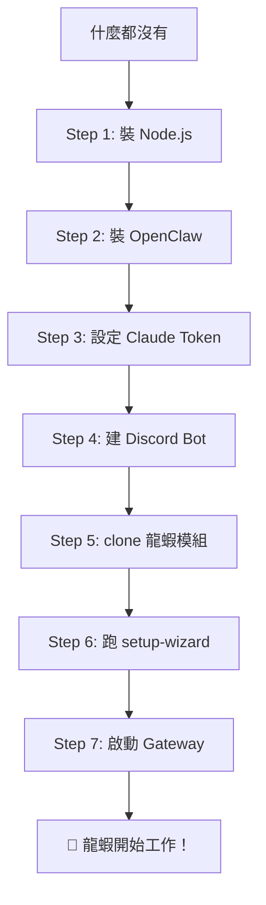

# 🦞 完整安裝流程（從零到跑起來）

> 學員的完整體驗路徑，從什麼都沒有到龍蝦開始自動工作。

## 流程圖



## Step 1: 安裝 Node.js
```bash
# 去 https://nodejs.org 下載 LTS 版本
node --version  # 確認 v18 以上
```

## Step 2: 安裝 OpenClaw
```bash
npm install -g openclaw
openclaw --version  # 確認安裝成功
```

## Step 3: 設定 Claude Token
```bash
openclaw setup
# 選擇 Anthropic → 貼上你的 Claude API token
# Token 取得方式：claude.ai → Settings → API
```

## Step 4: 建立 Discord Bot
1. 到 https://discord.com/developers/applications
2. 新建 Application → Bot
3. 複製 Bot Token
4. 開啟 3 個 Privileged Intents（Message Content、Server Members、Presence）
5. 邀請 Bot 到你的 Discord Server
```bash
# 在 openclaw.json 加入 Discord 設定
openclaw channels login --channel discord
```

## Step 5: Clone 龍蝦模組
```bash
# 以 lobster-adspower 為例
git clone https://github.com/maxtsai01/lobster-adspower.git
cd lobster-adspower
npm install
```

## Step 6: 跑 Setup Wizard
```bash
node scripts/setup-wizard.js
# 精靈會一步步引導你完成所有設定
# 每一步都有驗證，確保設定正確
```

## Step 7: 啟動 Gateway
```bash
openclaw gateway start
# 龍蝦上線！開始自動工作
```

## 驗證
- Discord 傳訊息給你的 Bot → 有回應 = 成功
- 檢查 Google Sheet → 有新資料 = 自動化在跑

## 卡住了？
→ 看 `05-troubleshooting/agent-not-responding.md`
