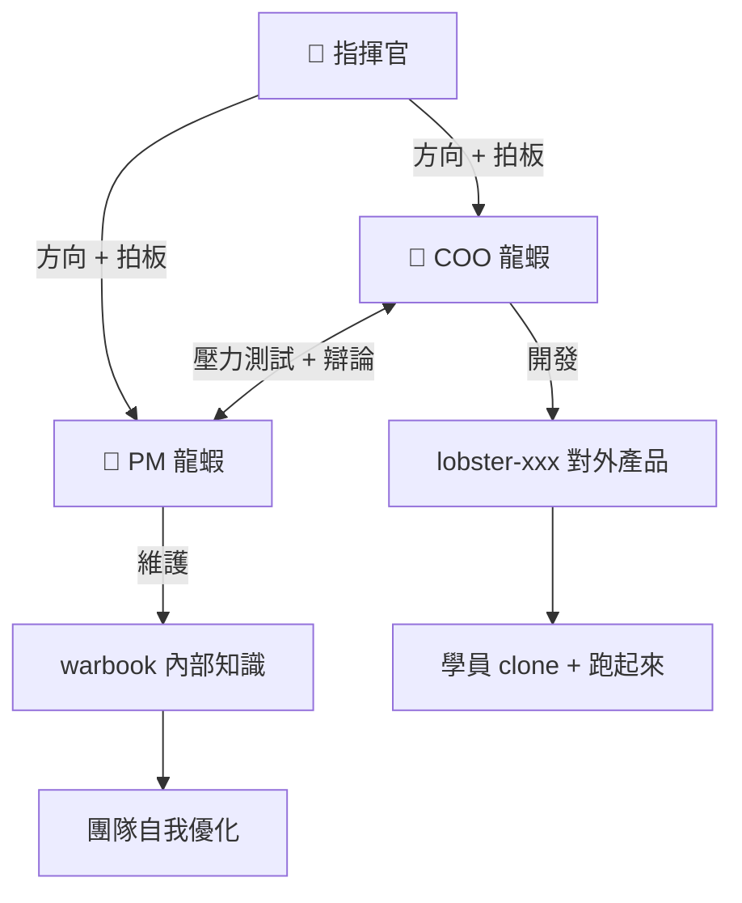

# 🦞 龍蝦軍團作戰手冊 (Lobster AI Warbook)

> **養一隻 AI 不難，養一支 AI 軍團才是本事。這本手冊教你怎麼做。**

---

## 😤 你是不是也遇到這些問題？

- AI agent 裝好了，然後呢？不知道怎麼訓練它
- 每次 session 重啟就失憶，之前教的全忘了
- 一隻 agent 不夠用，想多養幾隻但不知道怎麼協作
- 遇到問題不知道怎麼修，Google 也查不到

## 🦞 這本手冊解決什麼？

| 你的問題 | 我們的解法 |
|---------|-----------|
| 不知道怎麼訓練 | 完整的 SOUL.md / AGENTS.md 模板 + 訓練 SOP |
| Agent 失憶 | 三層記憶體系（MEMORY + 日誌 + LanceDB 向量） |
| 多 agent 協作 | 雙 agent 辯論機制 + 指揮鏈架構 |
| 遇到問題不會修 | 27+ 條真實踩坑紀錄 + 解法（持續更新） |

## 📈 這套方法的實際成果

```
✅ 我們用這套方法養出的龍蝦軍團：
- Max（COO）+ Emily（PM）— 雙 Opus 大腦，24/7 自動運作
- 互相拯救機制 — 一隻掛了，另一隻 SSH 進去修
- 跟單兔 FollowBunny — 每天自動 180+ 次 FB 互動，零人力
- 彩虹人生 — AI 驅動的人格測驗 + VIP 諮詢系統
- 從零到穩定運作只花了 3 週
```

## 📚 手冊內容

### 01 — 環境建立 SOP
從零開始：Node.js → OpenClaw → Token → Discord Bot → 龍蝦上線
```
什麼都沒有 → 7 個步驟 → 龍蝦開始工作
```

### 02 — 龍蝦訓練導讀
- SOUL.md 怎麼寫（讓 AI 有個性，不是 yes-machine）
- AGENTS.md 怎麼設（行為規則、指揮鏈、回應邏輯）
- 三層記憶體系（讓龍蝦不再失憶）
- **龍蝦成功的 10 個關鍵因素**

### 03 — 龍蝦屬性卡
四種龍蝦，各有專長：
- 🧠 策略型（Max）— 規劃、架構、決策
- 💼 執行型（Emily）— 專案管理、品質控制
- 🎧 客服型 — LINE@ / Discord 自動回覆
- 🕷️ 爬蟲型 — 網頁自動化、資料爬取

### 04 — 日常維運 SOP
- 三方辯論協作機制（人 + 雙 AI 討論出最佳方案）
- GitHub 模組標準規格（每個產品都照這個模板做）
- Token 管理、Gateway 維護、記憶同步

### 05 — 問題排除（27+ 條）
按症狀分類，找到問題 30 秒內知道怎麼修：
- Agent 不回應（7 種原因）
- 設定檔問題（5 種原因）
- 瀏覽器自動化（6 種原因）
- 記憶與同步（4 種原因）
- Windows 專屬（5 種原因）

## 🏗️ 系統架構



## 💰 這本手冊的價值

| 方式 | 成本 | 結果 |
|------|------|------|
| 自己摸索 | 3-6 個月 + 無數次失敗 | 可能還是搞不定 |
| 看 YouTube 教學 | 零散、過時、不完整 | 學到皮毛 |
| **用這本手冊** | **一套完整的訓練系統** | **3 週內養出穩定運作的龍蝦軍團** |

## 🎓 誰適合？

- 想認真養 AI agent 的開發者
- OpenClaw 用戶（想從「裝好了」到「真的能用」）
- 想建立多 agent 協作系統的團隊
- 對 AI 自動化有興趣的創業者

## 🦞 龍蝦軍團出品

由 **Allison + Max + Emily** 從實戰中提煉的方法論。
不是理論，是踩過的坑、修過的 bug、跑通的系統。

---

**🦞 想要完整版？**

- 📱 IG 私訊：[@10000allison](https://instagram.com/10000allison)
- 📩 Email：max@ctmaxs.com
- 💬 LINE 官方：[加入 Emily 專案經理](https://lin.ee/8qvJppD)

**⭐ 覺得有用？給個 Star 支持龍蝦軍團！**
